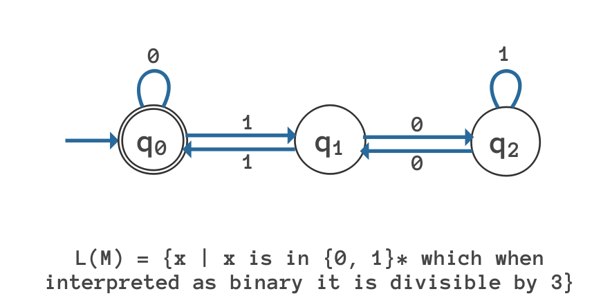

# Deterministic Finite Automata (DFA) implementation

## [What is Deterministic Finite Automata(DFA)?](https://www.javatpoint.com/deterministic-finite-automata)
* DFA refers to deterministic finite automata. Deterministic refers to the uniqueness of the computation. The finite automata are called deterministic finite automata if the machine is read an input string one symbol at a time.

* In DFA, there is only one path for specific input from the current state to the next state.

* DFA does not accept the null move, i.e., the DFA cannot change state without any input character.

* DFA can contain multiple final states. It is used in Lexical Analysis in Compiler.

#### A DFA is a collection of 5-tuples same as we described in the definition of FA.
> Q: finite set of states  
> ∑: finite set of the input symbol  
> δ: Transition function  
> Q0: initial state   
> F: final state  


#### Transition function can be defined as:
> δ: Q x ∑→Q  


## Usage
> Example
> L(M) = {x | x is in {0, 1}* which when interpreted as binary it is divisible by 3}



```python
from rebuni import DFA


STATES = (0, 1, 2)
SYMBOLS = ("0", "1")
TRANSITIONS = {0: {"0": 0, "1": 1}, 1: {"0": 2, "1": 0}, 2: {"0": 1, "1": 2}}

dfa = DFA(
    STATES,
    SYMBOLS,
    transition_function=TRANSITIONS,
    intial_state=0,
    final_states=0,
)
fails = 0

for number in range(10000): # Test using the first 10000 natural number
    number_binary = bin(number).lstrip('0b')
    checker = (number % 3 == 0)
    if dfa.check_state(number_binary) != checker:
        fails += 1
print(f'{fails} Fails')
```

### Thank You!
